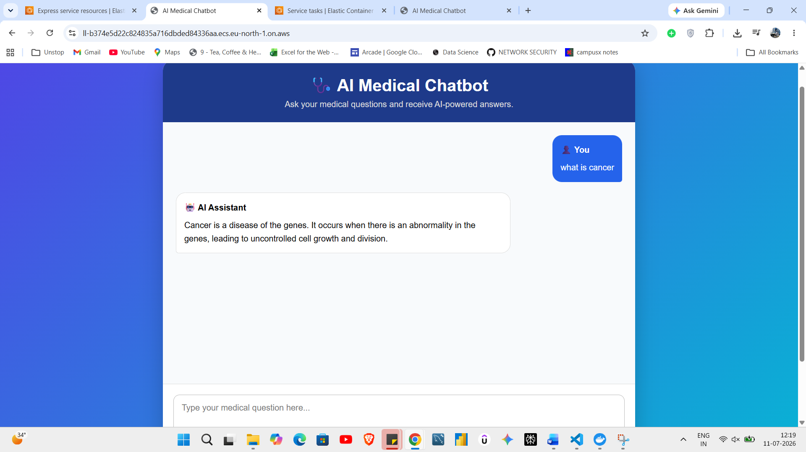
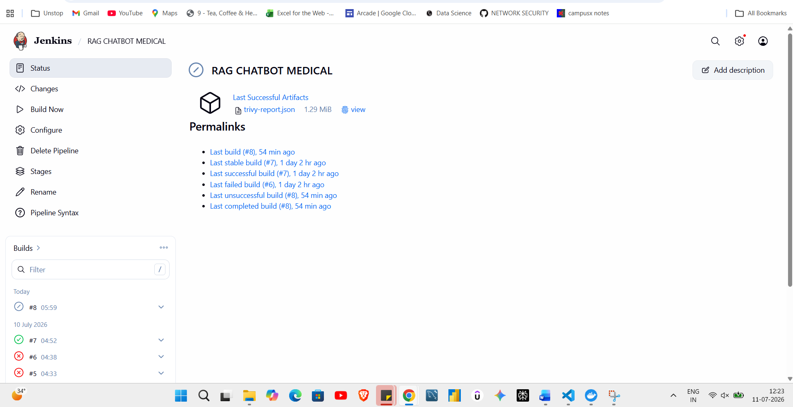
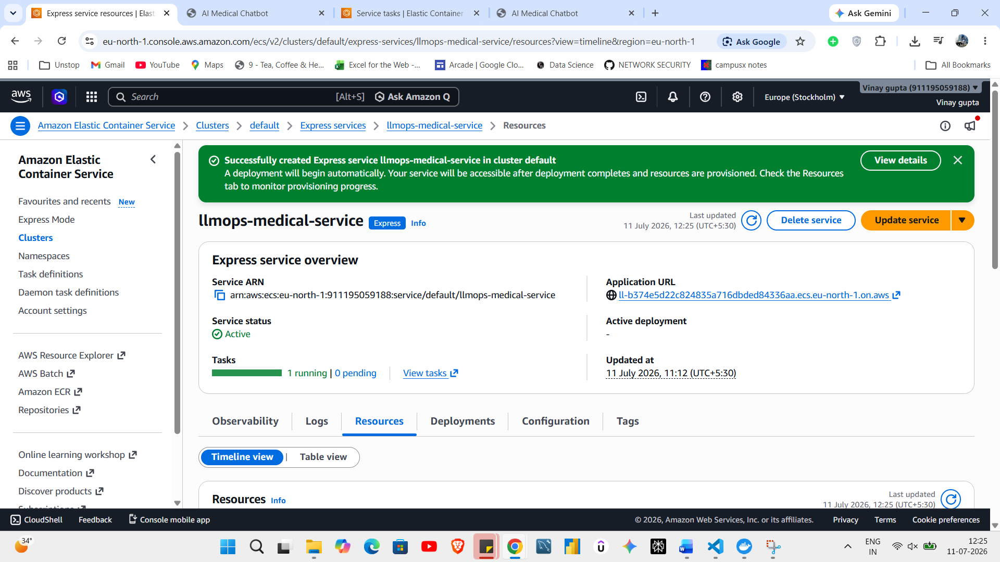
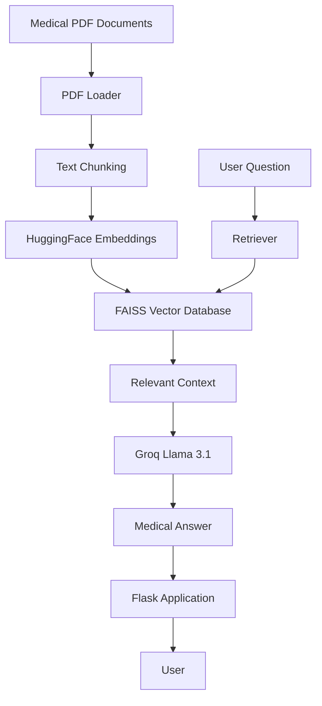

# 🏥 MediAssist AI

> **An AI-Powered Medical RAG Chatbot built using LangChain, Groq Llama 3.1, FAISS, Flask, Docker, Jenkins, AWS ECR, and AWS ECS.**

---

## 🚀 Live Demo

🌐 **Application:**  
https://ll-b374e5d22c824835a716dbded84336aa.ecs.eu-north-1.on.aws/

---

## 📂 GitHub Repository

https://github.com/VinaySinghal1/MediAssist-AI

---

# 📖 Project Overview

MediAssist AI is a Retrieval-Augmented Generation (RAG) chatbot that answers medical-related questions using medical PDF documents.

Instead of relying only on the Large Language Model's knowledge, the chatbot first retrieves relevant medical information from a vector database and then generates an accurate response using **Groq Llama 3.1**.

The complete project follows an industry-level CI/CD pipeline using **Docker**, **Jenkins**, **Trivy**, **AWS ECR**, and **AWS ECS**.

---

# ✨ Features

- 📄 Medical PDF Processing
- 🔍 Semantic Search using FAISS
- 🤖 Llama 3.1 via Groq API
- 🧠 HuggingFace Embeddings
- 📚 Retrieval-Augmented Generation (RAG)
- ⚡ Fast Flask Backend
- 🐳 Dockerized Application
- 🔄 Jenkins CI/CD Pipeline
- 🔐 Trivy Security Scanning
- ☁️ AWS ECR Deployment
- 🚀 AWS ECS Deployment
- 📝 Logging and Custom Exception Handling

---

# 🏗️ System Architecture

```
                  Medical PDFs
                       │
                       ▼
               PDF Loader (PyPDF)
                       │
                       ▼
             Text Chunking (LangChain)
                       │
                       ▼
      HuggingFace Embedding Model
                       │
                       ▼
               FAISS Vector Store
                       │
             User Medical Question
                       │
                       ▼
          Similar Context Retrieval
                       │
                       ▼
             Groq Llama 3.1 LLM
                       │
                       ▼
            AI Generated Medical Answer
```

---

# 🛠️ Tech Stack

## Programming Language

- Python

## Backend

- Flask

## LLM

- Groq Llama 3.1

## RAG Framework

- LangChain

## Embedding Model

- sentence-transformers/all-MiniLM-L6-v2

## Vector Database

- FAISS

## PDF Loader

- PyPDF

## DevOps

- Docker
- Jenkins
- Trivy
- AWS ECR
- AWS ECS

## Version Control

- Git
- GitHub

---

# 📁 Project Structure

```
MediAssist-AI
│
├── app
│   ├── common
│   ├── components
│   │      ├── data_loader.py
│   │      ├── pdf_loader.py
│   │      ├── embeddings.py
│   │      ├── vector_store.py
│   │      ├── retriever.py
│   │      └── llm.py
│   │
│   ├── config
│   ├── templates
│   └── application.py
│
├── custom_jenkins
│   └── Dockerfile
│
├── data
├── vectorstore
├── logs
├── Dockerfile
├── Jenkinsfile
├── requirements.txt
├── setup.py
└── README.md
```

---

# ⚙️ Installation

## Clone Repository

```bash
git clone https://github.com/VinaySinghal1/MediAssist-AI.git

cd MediAssist-AI
```

---

## Create Virtual Environment

Windows

```bash
python -m venv venv

venv\Scripts\activate
```

Linux/Mac

```bash
python3 -m venv venv

source venv/bin/activate
```

---

## Install Dependencies

```bash
pip install -r requirements.txt

pip install -e .
```

---

# 🔑 Environment Variables

Create a `.env` file inside the project root.

```
GROQ_API_KEY=your_groq_api_key

HUGGINGFACE_API_KEY=your_huggingface_api_key
```

---

# ▶️ Run the Application

```bash
python app/application.py
```

The application will start on

```
http://localhost:5000
```

---

# 🐳 Docker

## Build Image

```bash
docker build -t mediassist-ai .
```

## Run Container

```bash
docker run -p 5000:5000 mediassist-ai
```

---

# 🔄 CI/CD Pipeline

The project uses Jenkins for Continuous Integration and Continuous Deployment.

Pipeline Flow

```
GitHub

   │

   ▼

Jenkins

   │

   ▼

Docker Build

   │

   ▼

Trivy Security Scan

   │

   ▼

Push Image to AWS ECR

   │

   ▼

Deploy to AWS ECS

   │

   ▼

Live Application
```

---

# ☁️ AWS Deployment

The application is deployed on **Amazon ECS**.

Deployment workflow:

- Build Docker Image
- Security Scan using Trivy
- Push Image to AWS ECR
- Deploy Container on AWS ECS

---

# 📦 Requirements

Main Libraries

- LangChain
- LangChain Community
- LangChain HuggingFace
- LangChain Groq
- FAISS
- Flask
- PyPDF
- HuggingFace Hub
- Sentence Transformers
- Python Dotenv

---
# 📸 Screenshots

## Home Page



---


## Jenkins Pipeline



---


## AWS ECS






# 🔮 Future Improvements

- User Authentication
- Conversation History
- Medical Report Upload
- Multi-Language Support
- Voice Assistant
- Streaming Responses
- Redis Caching
- Kubernetes Deployment

---

# 👨‍💻 Author

**Vinay Singhal**

Artificial Intelligence & Data Science Student

GitHub

https://github.com/VinaySinghal1

---

# ⭐ If you like this project

Please give this repository a ⭐ on GitHub.